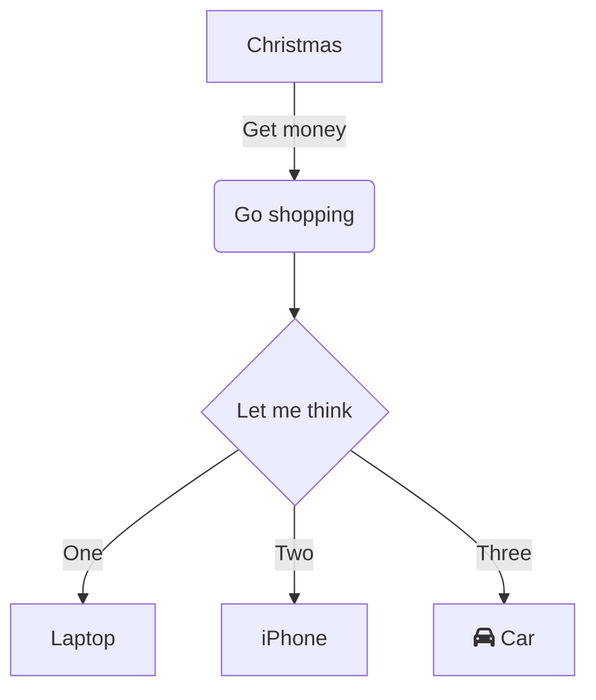

<SwmSnippet path="/app/Http/Controllers/ColumnController.php" line="12">

---

&nbsp;

```hack
    public function mapcolumn(Request $request){
        Column_Map::mapColumn($request);
        return false;
    }
```

---

</SwmSnippet>



<SwmMeta version="3.0.0" repo-id="Yml0YnVja2V0JTNBJTNBc291cmNpbmctcG9ydGFsJTNBJTNBYnJvd250b3du" repo-name="sourcing-portal"><sup>Powered by [Swimm](https://app.swimm.io/)</sup></SwmMeta>
